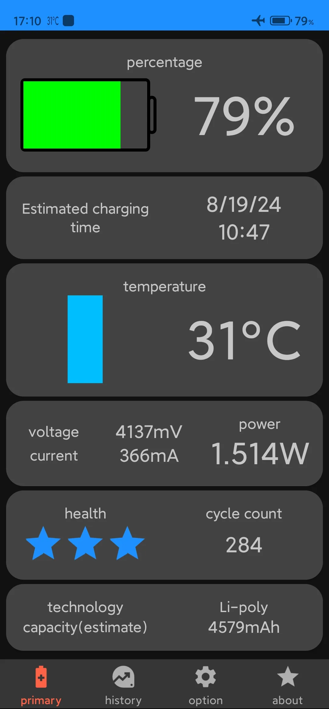
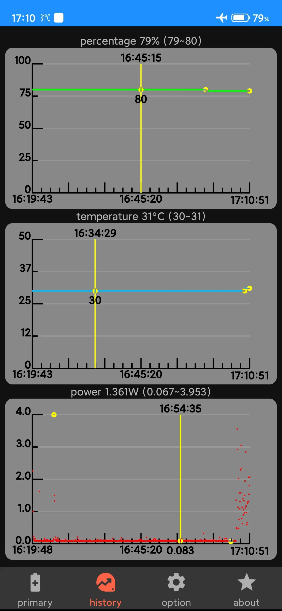
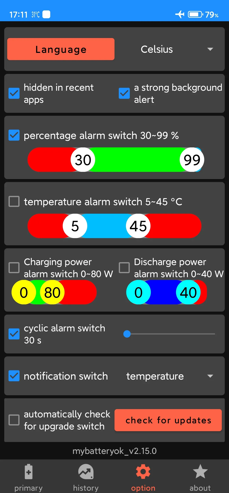

我的电池OK(mybatteryOK)是免费app,用于显示电池使用情况信息,并可以设置电量百分比,温度,充放电功率的报警来提醒你正确使用电池

我的電池OK(mybatteryOK)是免費app,用於顯示電池使用方式資訊,並可以設置電量百分比，溫度，充放電功率的報警來提醒你正確使用電池

mybatteryOK is a free app that displays battery usage information and can set alarms for battery percentage, temperature, and charging and discharging power to remind you to use the battery correctly

mybatteryOK est une application gratuite qui affiche des informations sur l’utilisation de la batterie et peut définir des alarmes pour le pourcentage de la batterie, la température et la puissance de charge et de décharge pour vous rappeler d’utiliser correctement la batterie

mybatteryOK ist eine kostenlose App, die Informationen zum Batterieverbrauch anzeigt und Alarme für den Batterieprozentsatz, die Temperatur sowie die Lade- und Entladeleistung einstellen kann, um Sie daran zu erinnern, den Akku richtig zu verwenden

Το mybatteryOK είναι μια δωρεάν εφαρμογή που εμφανίζει πληροφορίες χρήσης μπαταρίας και μπορεί να ρυθμίσει ξυπνητήρια για το ποσοστό της μπαταρίας, τη θερμοκρασία και την ισχύ φόρτισης και εκφόρτισης για να σας υπενθυμίσει να χρησιμοποιείτε σωστά την μπαταρία

mybatteryOK è un'app gratuita che visualizza le informazioni sull'utilizzo della batteria e può impostare allarmi per la percentuale della batteria, la temperatura e la potenza di carica e scarica per ricordarti di utilizzare correttamente la batteria

mybatteryOKは、バッテリーの使用状況情報を表示し、バッテリーのパーセンテージ、温度、充電と放電の電力のアラームを設定して、バッテリーを正しく使用するように通知できる無料アプリです

mybatteryOK는 배터리 사용량 정보를 표시하고 배터리 백분율에 대한 알람을 설정할 수 있는 무료 앱입니다.tage, 온도, 충전 및 방전 전력은 배터리를 올바르게 사용하도록 알려줍니다

mybatteryOK é um aplicativo gratuito que exibe informações de uso da bateria e pode definir alarmes para porcentagem de bateria, temperatura e carga e descarga de energia para lembrá-lo de usar a bateria corretamente

mybatteryOK es una aplicación gratuita que muestra información sobre el uso de la batería y puede configurar alarmas para el porcentaje de la batería, la temperatura y la potencia de carga y descarga para recordarle que debe usar la batería correctamente

mybatteryOK เป็นแอปฟรีที่แสดงข้อมูลการใช้แบตเตอรี่และสามารถตั้งปลุกสําหรับเปอร์เซ็นต์แบตเตอรี่ tage อุณหภูมิและการชาร์จและการคายประจุเพื่อเตือนให้คุณใช้แบตเตอรี่อย่างถูกต้อง

mybatteryOK là một ứng dụng miễn phí hiển thị thông tin sử dụng pin và có thể đặt báo thức cho phần trăm pin, nhiệt độ và nguồn sạc và xả để nhắc nhở bạn sử dụng pin đúng cách

mybatteryOK היא אפליקציה חינמית המציגה מידע על שימוש בסוללה ויכולה להגדיר התראות עבור אחוז סוללה, טמפרטורה ועוצמת טעינה ופריקה כדי להזכיר לך להשתמש בסוללה כראוי

mybatteryOK is een gratis app die informatie over het batterijgebruik weergeeft en alarmen kan instellen voor het batterijpercentage, de temperatuur en het laad- en ontlaadvermogen om u eraan te herinneren de batterij correct te gebruiken

mybatteryOK é um aplicativo gratuito que exibe informações de uso da bateria e pode definir alarmes para porcentagem da bateria, temperatura e energia de carga e descarga para lembrá-lo de usar a bateria corretamente

mybatteryOK on ilmainen sovellus, joka näyttää akun käyttötiedot ja voi asettaa hälytyksiä akun prosenttiosuudesta, lämpötilasta sekä lataus- ja purkutehosta muistuttamaan akun oikeasta käytöstä

mybatteryOK, pil kullanım bilgilerini görüntüleyen ve pili doğru şekilde kullanmanızı hatırlatmak için pil yüzdesi, sıcaklık ve şarj ve deşarj gücü için alarmlar ayarlayabilen ücretsiz bir uygulamadır

mybatteryOK adalah aplikasi gratis yang menampilkan informasi penggunaan baterai dan dapat mengatur alarm untuk persentase bateraitage, suhu, dan daya pengisian dan pengosongan untuk mengingatkan Anda untuk menggunakan baterai dengan benar

mybatteryOK एक निःशुल्क ऐप है जो बैटरी उपयोग की जानकारी प्रदर्शित करता है और बैटरी प्रतिशत, तापमान, और चार्जिंग और डिस्चार्जिंग पावर के लिए अलार्म सेट कर सकता है ताकि आपको बैटरी का सही उपयोग करने के लिए याद दिलाया जा सके

mybatteryOK ialah aplikasi percuma yang memaparkan maklumat penggunaan bateri dan boleh menetapkan penggera untuk peratusan bateri, suhu, dan kuasa pengecasan dan nyahcas untuk mengingatkan anda menggunakan bateri dengan betul

mybatteryOK to bezpłatna aplikacja, która wyświetla informacje o zużyciu baterii i może ustawiać alarmy dotyczące procentu baterii, temperatury oraz mocy ładowania i rozładowywania, aby przypomnieć o prawidłowym użytkowaniu baterii

بلدي بطارية موافق ( mybatteryok ) هو التطبيق مجانا ، وتستخدم لعرض معلومات عن استخدام البطارية ، ويمكن تعيين نسبة مئوية من الكهرباء ، درجة الحرارة ، تهمة والتفريغ السلطة التنبيه لتذكيرك بشكل صحيح استخدام البطارية

mybatteryOK är en gratis app som visar information om batterianvändning och kan ställa in larm för batteriprocent, temperatur och laddnings- och urladdningseffekt för att påminna dig om att använda batteriet på rätt sätt

mybatteryOK — это бесплатное приложение, которое отображает информацию об использовании батареи и может устанавливать сигналы тревоги о проценте заряда батареи, температуре, а также мощности зарядки и разрядки, чтобы напомнить вам о правильном использовании батареи

MybatteryOK ایک منفی کاروبار ہے جو باتری استعمال معلومات کو دکھاتا ہے اور باتری فیصد، تولید، اور چارڈ/ڈیشارڈ پاور کے لئے الرمنڈ سیٹ کر سکتا ہے تاکہ آپ کو بٹری سیدھی طور پر استعمال کریں

mybatteryOK একটি নিখরচায় অ্যাপ যা ব্যাটারি ব্যবহারের তথ্য প্রদর্শন করে এবং ব্যাটারির শতাংশ, তাপমাত্রা এবং চার্জিং ও ডিসচার্জিংয়ের জন্য অ্যালার্ম সেট করতে পারে যাতে আপনাকে ব্যাটারিটি সঠিকভাবে ব্যবহার করার কথা মনে করিয়ে দেওয়া যায়

